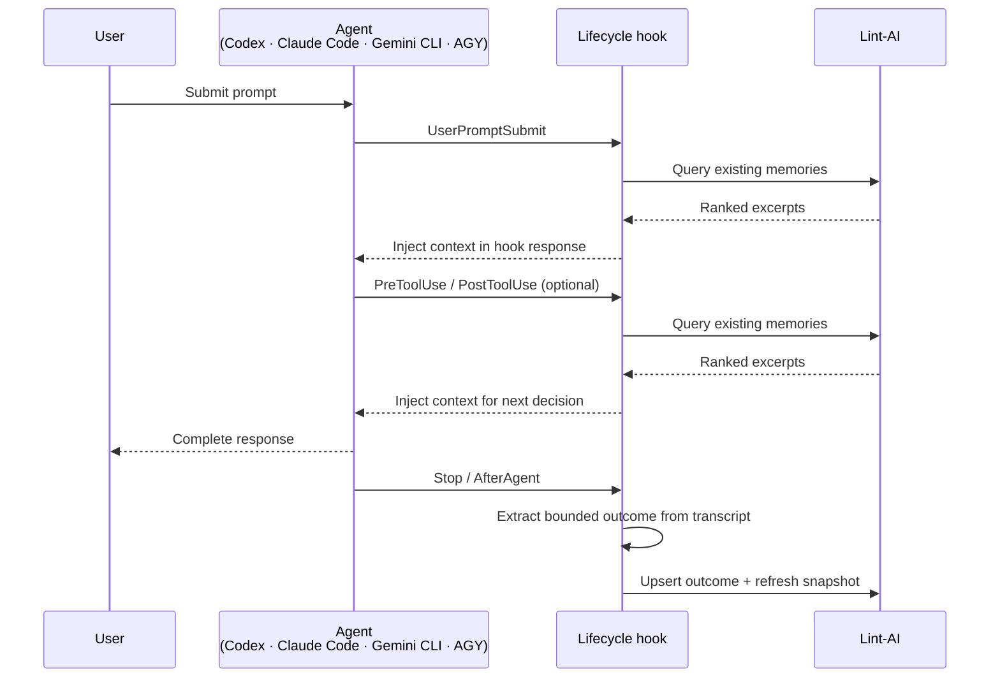

# Agent Integrations

Lint-AI connects to agent clients through lifecycle hooks and a shared
file-based memory index. Each adapter preserves the host client protocol while
using the same capture, indexing, and retrieval model.

## Supported agents

| Agent | Integration guide | Memory store |
|---|---|---|
| Claude Code | [Claude Code](claude-code.md) | `.lint-ai/claude-memory` |
| Codex | [Codex](codex.md) | `.lint-ai/codex-memory` |
| Gemini CLI | [Gemini CLI](gemini-cli.md) | `.lint-ai/gemini-cli-memory` |
| Antigravity CLI | [Antigravity CLI](agy.md) | `.lint-ai/agy-memory` |

## How an agent uses memory

1. A lifecycle hook receives the agent event and transcript context.
2. Retrieval hooks query the existing `IndexStore` and return relevant context
   to the agent.
3. Capture hooks extract a bounded checkpoint, outcome, or session summary.
4. The adapter upserts the document and refreshes the index snapshot.
5. The next prompt can query the newly refreshed snapshot.

See [Server and MCP](server.md) for direct API access.

## Memory lifecycle

All supported adapters retrieve memory during an active turn and capture new
memory at lifecycle boundaries. The exact hook names vary by client, but the
contract is the same: query the current snapshot, capture durable context, then
refresh the snapshot.

### One turn inside a session



```text
1. User submits a prompt
2. Retrieval hook queries the existing IndexStore
3. Agent may call tools (pre-tool and post-tool hooks can retrieve context)
4. Agent finishes the turn
5. Stop/AfterAgent captures the turn outcome and refreshes IndexStore
6. The next prompt can retrieve that captured outcome
```

`Stop` (or Gemini CLI's `AfterAgent`) is a per-turn boundary and can occur
multiple times in one session. It is different from `SessionEnd`, which runs
when the entire session closes and captures the final session summary:

```text
Turn 1 → Stop       capture outcome
Turn 2 → Stop       capture outcome
Turn 3 → Stop       capture outcome
Session exits → SessionEnd   capture session summary
```

The current turn is not retroactively re-prompted with its newly captured
memory. That memory is injected on a later retrieval event.

### Retrieval events

Adapters query their provider-specific `IndexStore` on events such as:

- `SessionStart`
- `UserPromptSubmit`
- `PreToolUse` and `PostToolUse`
- `SubagentStart`

Selected records are returned as additional context to the client. Queries are
scoped to the active project and provider memory store.

### Retrieval and injection path

```text
Agent hook receives prompt/tool context
        ↓
Adapter builds a provider-scoped query
        ↓
IndexStore ranks matching records with project/user filters
        ↓
Adapter bounds and formats the selected excerpts
        ↓
Hook response returns the context to the host agent
        ↓
Host agent includes it in the next model/tool decision
```

The adapter does not rewrite the original user prompt. It uses each client’s
hook response protocol:

| Provider | Injection field |
|---|---|
| Claude Code | `hookSpecificOutput.additionalContext` |
| Codex | `hookSpecificOutput.additionalContext` |
| Gemini CLI | `hookSpecificOutput.additionalContext` |
| Antigravity CLI | `injectSteps[].ephemeralMessage` |

If the query is empty, the store is absent, or no relevant records survive
filtering, the hook returns no injected context and the agent continues normally.

### Turning the integration on and off

Memory behavior and session recording are independent controls exposed through
the provider’s Lint-AI MCP server:

| Control | Effect |
|---|---|
| `enable_lint_ai` | Turns retrieval and capture on; recording is enabled by default. |
| `disable_lint_ai` | Turns Lint-AI retrieval/injection and automatic capture off; existing recordings and memories remain. |
| `record_session` with `start` | Records hook events in capture-only mode without injecting memory. |
| `record_session` with `stop` | Stops recording without disabling memory integration. |
| `lint_ai_status` | Reports independent `Lint-AI:ON/OFF` and `Record:ON/OFF` state. |

The controls are project- and provider-scoped. Disabling the integration does
not uninstall hooks, delete the index, or delete session archives; it only
prevents Lint-AI from participating in subsequent turns.

### Hook events recorded for replay (no index update)

When session recording is enabled, the adapters record every supported hook
invocation for replay and diagnostics. These records are telemetry; they do
not update the searchable `IndexStore`:

| Provider | Recorded hook events |
|---|---|
| Claude Code | `SessionStart`, `UserPromptSubmit`, `UserPromptExpansion`, `PreToolUse`, `PostToolUse`, `PreCompact`, `Stop`, `SessionEnd`, `SubagentStart`, `SubagentStop` |
| Codex | `SessionStart`, `UserPromptSubmit`, `PreToolUse`, `PermissionRequest`, `PostToolUse`, `UserPromptExpansion`, `PreCompact`, `PostCompact`, `Stop`, `SessionEnd`, `SubagentStart`, `SubagentStop` |
| Gemini CLI | `SessionStart`, `BeforeAgent`, `AfterAgent`, `BeforeModel`, `BeforeToolSelection`, `BeforeTool`, `AfterTool`, `PreCompress`, `SessionEnd` |
| Antigravity CLI | `PreToolUse`, `PostToolUse`, `PreInvocation`, `PostInvocation`, `Stop` |

### Events that update searchable memory

| Provider | Capture-attempt events | Searchable store |
|---|---|---|
| Claude Code | `PreCompact`, `Stop`, `SessionEnd`, `SubagentStop` | `.lint-ai/claude-memory` |
| Codex | `PreCompact`, `PostCompact`, `Stop`, `SessionEnd`, `SubagentStop` | `.lint-ai/codex-memory` |
| Gemini CLI | `AfterAgent`, `PreCompress`, `SessionEnd` | `.lint-ai/gemini-cli-memory` |
| Antigravity CLI | `Stop` (transcript capture) | `.lint-ai/agy-memory` |

At a capture event, the adapter reads the transcript, extracts structured
memory, calls `IndexStore::upsert`, and then calls `refresh`. This makes the
document available in the index when the hook completes successfully, but it
does not inject the new document back into the conversation that just ended.
The document is returned on a later retrieval event, typically the next prompt
or next session. If the transcript is missing or produces no meaningful
content, the event completes without adding a document.

### Two kinds of persistence

- `IndexStore` contains searchable memory documents.
- Session recording archives raw provider hook events for replay and debugging.

Recording a hook event does not by itself make a document searchable; it must
also pass through the provider's capture and index-refresh path.

The HTTP/MCP API follows the same guarantee: a successful `memory_add` performs
the upsert and refresh before returning, so a subsequent `memory_search` can
query the new memory immediately.

## Provider-specific benchmarks

The [benchmark overview](benchmark.md),
[cross-client integration benchmark](benchmark-integration.md), and provider
benchmark pages document standalone retrieval, corpus-scale, and integration
measurements for these adapters.

Session recording is documented separately in
[Session recording](session-recording-design.md). It records lifecycle events
for replay and inspection and is intentionally independent from searchable
memory and context injection.

The provider MCP tools and their request semantics are documented in the
[MCP interface guide](mcp.md). For onboarding, see the Get started entries for
the [HTTP server](server.md) and [MCP interface](mcp.md).
