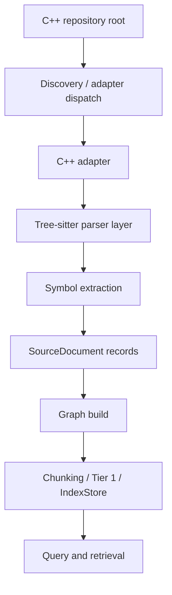

# C++ Code Adapter Design

This document describes the intended design for supporting a C++ repository
through the `lint-ai` adapter layer.

The goal is to make C++ a first-class code source without changing the current
Markdown pipeline or the downstream indexing model.

## Goals

- Support repository traversal for C++ source trees.
- Extract code structure with Tree-sitter or a Tree-sitter-compatible parser.
- Normalize code into `SourceDocument` records for the existing graph and
  indexing pipeline.
- Enable symbol-aware retrieval for classes, structs, functions, methods,
  variables, namespaces, and includes.
- Preserve compatibility with the current `Graph::build()` entry point.

## Non-Goals

- Do not rewrite the current Markdown adapter.
- Do not replace the current graph or index layers.
- Do not require all language support to live in this repo forever.
- Do not make the first version depend on perfect C++ semantic analysis.

## Proposed Layering



## Repository Split

The recommended split is:

- `lint-ai`
  - adapter trait and registry
  - generic ingestion shape
  - graph construction
  - chunking, Tier 1, indexing, and query flow
- language parser package or repo
  - C++ Tree-sitter parsing
  - symbol extraction
  - language-specific relationship detection

The code adapter in `lint-ai` should remain thin and delegate to the language
parser package.

## Canonical Output Shape

The adapter boundary should emit `SourceDocument` directly.

For C++, a `SourceDocument` should represent one of the following:

- file-level document
- namespace-level document
- class or struct document
- function or method document
- optionally, variable or member-focused documents if needed

Recommended fields:

- `doc_id`
  - stable and deterministic
- `source`
  - file path plus symbol scope when applicable
- `content`
  - source text or scoped source text
- `concept`
  - canonical symbol name or file subject
- `group_id`
  - logical grouping for all symbols in one file or module
- `headings`
  - structural labels such as `class Foo`, `namespace bar`
- `links`
  - referenced symbols, includes, base classes, or member references
- `timestamp`
  - file modification timestamp when available
- `doc_length`
  - text length in bytes
- `author_agent`
  - usually unused for code, but preserved for compatibility

## C++ Parsing Strategy

Use Tree-sitter to parse source files and build a symbol inventory.

Initial file set:

- `.cpp`
- `.cc`
- `.cxx`
- `.hpp`
- `.hh`
- `.h`
- `.hxx`

Initial extraction targets:

- namespaces
- classes
- structs
- enums
- functions
- methods
- fields and variables
- `#include` directives
- base-class declarations
- identifier references inside symbol bodies

The first version does not need full semantic resolution from a compiler.
Tree-sitter structure is enough to produce useful retrieval records.

## Document Granularity

The adapter should not force every file into a single document.
For C++, retrieval is better when the adapter emits multiple symbol-scoped
documents per file.

Example from one file:

- file document
- namespace document
- class document
- method document

This allows a query like `className` to return:

- the class definition
- methods defined in the class
- references to the class
- related types in the same file or namespace

## Relationship Model

The adapter should preserve lightweight edges as symbol links:

- class -> base class
- class -> member field
- class -> method
- method -> referenced type
- file -> included header
- namespace -> contained symbols

These links should be flattened into `SourceDocument.links` when possible so the
current graph and retrieval layers can continue to operate unchanged.

## Query Expectations

For a query like `className`, expected retrieval should include:

- the file that defines `className`
- the class document for `className`
- subclasses or derived classes if known
- methods and fields inside that class
- references to `className` from other files

For a query like `variableName`, expected retrieval should include:

- the variable declaration
- the enclosing function or class
- references where the variable is used

## Adapter Contract

The `SourceAdapter` trait in `lint-ai` should remain simple:

```rust
pub trait SourceAdapter {
    fn name(&self) -> &'static str;
    fn supports(&self, path: &std::path::Path) -> bool;
    fn ingest(
        &self,
        input: &AdapterInput<'_>,
    ) -> anyhow::Result<Vec<lint_ai::SourceDocument>>;
}
```

The C++ adapter should be responsible for:

- recognizing supported file extensions
- invoking the language parser
- transforming parser output into `SourceDocument`
- attaching stable identifiers and symbol-scoped metadata

## Suggested Next Step

Before implementation, define the C++ parser output contract in a separate
document or crate:

- symbol kind
- symbol name
- fully qualified name
- file path
- byte range
- parent symbol
- references
- base types
- includes

That contract should be stable enough for both `lint-ai` and any future
language-specific repo.
