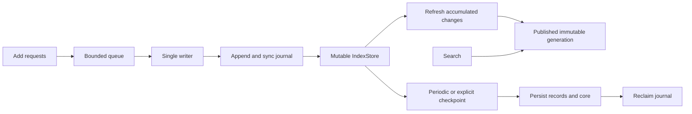

# IndexStore and MemoryIndex Concurrency

This note captures the recommended concurrency model for large Lint-AI
deployments.

## Current Model

`IndexStore` is the mutable owner of the corpus state:

- source documents
- derived `DocRecord`s
- chunk lifecycle metadata
- temporal facts
- the current semantic `MemoryIndex` snapshot

`MemoryIndex` is the immutable semantic query snapshot. It is optimized for
batch construction and fast reads over compact global structures, including
the snapshot's Tantivy lexical index. It is not the right object to mutate
incrementally in place.

`IndexStore::refresh()` builds and publishes a complete immutable generation.
The HTTP server has one mutable `MemoryService` owner and a detached published
`MemoryService` read view. The indexes are shared through `Arc`; visibility
and reranking metadata are captured with the same generation. Each search
retains that view independently of the mutable owner's lock.

## Staged HTTP writes



With a disk-backed `--index`, the primary HTTP `/add` and `/add/batch` endpoints acknowledge after validating
and syncing their transaction to `pending-adds.jsonl`, then applying it to the
mutable store. They do not refresh for each add. The default response includes
`published: false` when the request is staged; it has no final adjudication.

Publication starts 250 ms after the first pending add, or after 512 pending
documents. These are scheduling triggers, not latency guarantees: rebuilds,
checkpoints and queued writes take additional time. The deadline is not reset
by incoming writes. The writer builds one generation at a time. Requests arriving
during a refresh wait in a queue of 32 commands; full admission returns `429`.
Unpublished document accumulation is also bounded at 32,768 documents and returns
`429` when admission would exceed it. In-memory services have the same publication
contract but cannot promise restart durability.

Full checkpoints run every 30 seconds and on explicit flush. Publication can
reuse unchanged segments without rewriting the full persisted corpus each time.
The journal remains available until a successful checkpoint has synced records,
lifecycle state and the binary core. Startup replays complete transaction lines
idempotently and drops an interrupted final line. A remaining journal forces a
rebuild, including when a crash left newer records alongside an older core.
Committed journal corruption fails startup instead of silently dropping writes.

`POST /flush` and `POST /v1/memories/refresh` publish and checkpoint all previously
accepted queued writes. SIGINT and SIGTERM drain HTTP requests and flush before
shutdown. A killed process recovers acknowledged writes from its journal.
Cancelling an HTTP request does not cancel a command already admitted to the writer.

Use `?wait_for_visibility=true` on either add endpoint for immediate visibility
and the existing final adjudication response. Idempotently retrying that request
after publication also returns its final receipt. Synchronous library calls,
hooks and provider-memory HTTP endpoints retain their immediate publication
behavior; synchronous mutations checkpoint outstanding staged adds before
returning, so a later restart cannot replay an add that was subsequently deleted.

Configure the primary HTTP writer with:

| Server option | Default | Meaning |
|---|---:|---|
| `--refresh-interval-ms` | 250 | Delay from the first pending add |
| `--refresh-batch-size` | 512 | Pending documents that trigger publication |
| `--checkpoint-interval-seconds` | 30 | Full checkpoint cadence |

All values must be positive. Disk-backed staging requires a single process
owner of the index root. It is not a distributed writer protocol; direct writes
from a second process to the same root are unsupported. Use a dedicated `--index`
root for the primary HTTP ingestion server and route its writes through that server.
Metadata is cloned once per publication, so retained generations consume memory
and publication cost still grows with corpus size. Full refresh work can delay
write acknowledgements even though searches keep using the previous generation.

## Recommended Rule

There are two separate concurrency questions:

- snapshot publication: how many replacements for the currently queryable
  state should be built at the same time
- segmentation: whether one logical corpus should be represented by many
  smaller queryable `MemoryIndex` segments

For snapshot publication, build at most one replacement generation at a time.

In steady state, a store should have:

- one published query generation used by readers
- zero or one pending query generation for the next revision

If the store is not segmented, a query generation is one `MemoryIndex`. If the
store is segmented, a query generation is a set of `MemoryIndex` segments plus a
router/merge layer.

Avoid building many complete replacement generations for the same store. They
duplicate most of the corpus in memory, compete for CPU, and usually finish with
obsolete revisions when writes continue arriving.

## Segmented MemoryIndex Sets

For large corpora, `IndexStore` can publish many smaller `MemoryIndex` segments
as one logical search surface.

Examples:

- docs corpus: one segment per folder, product area, or bounded chunk range
- one giant document: split into chunks, then pack those chunks into bounded
  segments
- agent memory: one segment per session, or per session window, when session is
  the natural routing unit

This is different from creating many unrelated `IndexStore`s. The `IndexStore`
can still be the persistent owner of records, lifecycle metadata, and lexical
state, while the query layer owns a set of immutable segment snapshots.

A reasonable segment policy is:

- route-based segment when a stable key exists, such as folder, repo, session,
  tenant, language, or time window
- size-based segment when no stable key is small enough
- configurable default chunk/document limit per segment
- rebuild only the changed segment when possible
- publish the new segment set atomically as one generation

For a giant document split into chunks, the rough upper bound is:

```text
segment_count = ceil(total_chunks / memory_index_chunk_limit)
```

That segment count is not automatically the desired CPU concurrency. The build
concurrency should be capped separately by available cores, memory headroom, and
I/O pressure:

```text
build_parallelism = min(segment_count, configured_parallelism, resource_limit)
```

In other words, `memory_index_chunk_limit` controls segment size. A separate
parallelism limit controls how many segment builds can run at once.

The chunking/build pipeline is another level of parallelism. Its worker count
should normally be a small CPU-bound limit, for example four workers by default,
rather than the number of segments. That keeps the pipeline predictable:

```text
chunk_pipeline_workers = min(configured_workers, cpu_limit)
```

## Implemented Segmented Query Path

The current implementation builds validated segment snapshots, routes queries
to fixed or adaptive candidate sets, and merges segment results against shared
global BM25 statistics. It remains a single-process segmented index, not a
remote sharded storage system.

The implemented units are:

1. Define `MemoryIndexSegment`.
   - `segment_id`
   - `boundary`, such as folder, session, language, time window, or chunk range
   - `doc_ids`
   - one inner `MemoryIndex`
   - one compact `SegmentProfile`
2. Build profiles for existing records without changing query behavior.
3. Add a router that ranks segments for a query.
4. Query the top N routed segments and merge top-k results.
5. Expand the routed set adaptively when requested and evidence coverage is
   insufficient.
6. Publish the replacement segment set as one immutable generation.

This gives a small benchmarkable ladder. Each step can be compared against the
current one-global-`MemoryIndex` baseline.

## Segment Routing

Routing should start with cheap sparse statistics that match the current
implementation.

`MemoryIndex` already derives:

- important terms
- key entities
- topics
- document type guesses
- temporal metadata
- group/session metadata
- sparse postings

A `SegmentProfile` can summarize these as normalized distributions:

- term distribution
- entity distribution
- topic distribution
- doc type distribution
- optional time range
- optional route keys, such as folder/session/language

The first router can use sparse similarity:

```text
score(segment, query) =
  lexical_overlap(query_terms, segment_terms)
  + entity_overlap(query_entities, segment_entities)
  + topic_match(query_topic, segment_topics)
  + route_key_bonus
  + temporal_window_bonus
```

For a more ML-style router, treat the query as a sparse distribution and compare
it with each segment profile. KL divergence can work if smoothing is handled
carefully:

```text
route_score = -KL(query_distribution || segment_distribution)
```

Jensen-Shannon divergence may be safer for early implementation because it is
symmetric and bounded:

```text
route_score = 1 - JS(query_distribution, segment_distribution)
```

K-means is useful at segment construction time when there is no obvious boundary
like folder or session. In that case, cluster chunks/documents by sparse
term/entity vectors, then build one `MemoryIndex` per cluster. For docs and
agent-memory corpora, explicit boundaries should be tried first because they are
easier to explain and update incrementally.

The router should keep recall safeguards:

- query at least one fallback segment when routing confidence is low
- query more segments for broad or ambiguous questions
- preserve a `query_all_segments` debug mode
- record segment routing diagnostics in benchmarks

## Freshness Modes

The useful public API shape is likely three query modes:

- `Fresh`: synchronously refresh before query; best for correctness-sensitive
  reads and small stores.
- `LatestAvailable`: query the current snapshot immediately and start or poll a
  background refresh when the store is dirty; best default for large stores.
- `SnapshotOnly`: query the current snapshot without starting refresh work; best
  for high-QPS serving paths where refresh is scheduled separately.

The existing `query()` method behaves like `Fresh`.

## When To Use Multiple IndexStores

Use multiple `IndexStore`s only when there is a stable routing boundary that
queries can exploit before search:

- tenant or organization
- product area
- repository
- project or workspace
- time partition, if most queries target a known window
- language, once multi-language support has separate analyzers or ranking rules

Do not shard only because the corpus is large. Sharding helps when it reduces
the candidate set for most queries. If every query must fan out to every shard,
the system pays extra orchestration and merge cost while losing global ranking
context.

When the desired behavior is "one corpus, many searchable pieces," prefer
segmented `MemoryIndex` sets inside one logical `IndexStore` before splitting
into many independent stores.

## Large Corpus Strategy

For a huge corpus, prefer this order:

1. Keep one `IndexStore` per routable corpus scope.
2. Add `MemoryIndex` segmentation inside that store when the corpus is too large
   for one snapshot.
3. Publish one query generation at a time, where a generation may contain many
   segments.
4. Rebuild only changed segments when possible.
5. Cap segment build parallelism separately from segment count.
6. Debounce rebuilds when many writes arrive together.
7. Add a scheduled refresh path for serving workloads.
8. Split into multiple `IndexStore`s only after query routing data shows most
   queries hit a subset.

This model keeps memory bounded and avoids rebuilding obsolete snapshots.

## Current Implementation and Remaining Work

Current behavior:

- `SourceDocument` is the canonical ingestion unit.
- `MemoryIndexLayout` selects `Single`, `Segmented`, or `AdaptiveSegmented`.
- Segmented layouts build one validated `MemoryIndex` per group/session
  boundary and publish the complete set as one generation.
- Fixed routing queries the configured top-N segments. Adaptive routing starts
  at the same top-N and expands to `max_query_n` when evidence coverage is
  insufficient.
- Empty or low-signal routes execute a bounded deterministic fallback, and
  diagnostics report the segments actually executed.
- The primary HTTP server stages adds and schedules publication through one
  writer. Searches retain a detached `MemoryService` view and its immutable
  snapshot independently of the mutable owner lock.
- Segmented refreshes rebuild affected segments and share unchanged segment
  indexes. Single-index refreshes rebuild that index. Publication replaces the
  complete generation atomically; query postings are not mutated in place.
- Full checkpoints persist records, lifecycle metadata and the binary core.
  Scheduled publications defer that corpus-wide persistence until checkpoint.

Operational metrics that remain useful include segment count, selected segment
IDs, routed relevant-segment recall, snapshot generation, build duration, and
query latency by routing mode.

## Validation of staged writes

`cargo test --lib` passed all 808 tests after this change. New coverage exercises
journal replay, incomplete tails, committed corruption, interrupted checkpoints,
symlink refusal, final receipt completion, deletion without resurrection,
concurrent adds, retained read generations, reads during a held owner lock,
publication during continuous writes, cancellation and bounded queue admission.
An HTTP test covers staged acknowledgement, flush, immediate-visibility retries
and user isolation. The release server built successfully, and the uv MkDocs
build and three generated-site tests passed.
