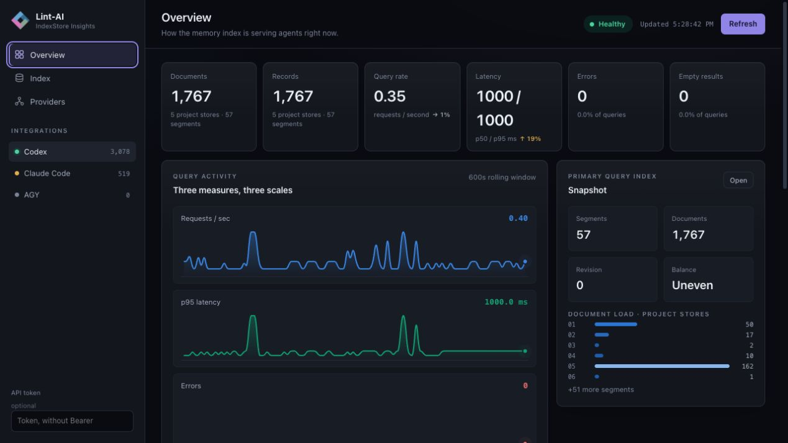
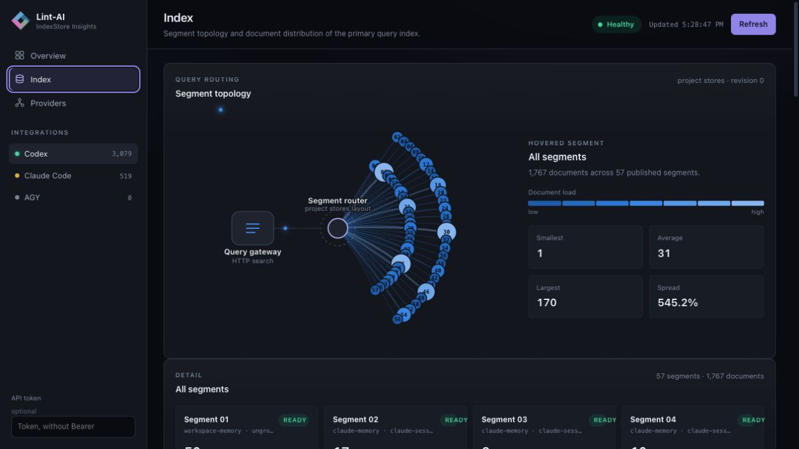
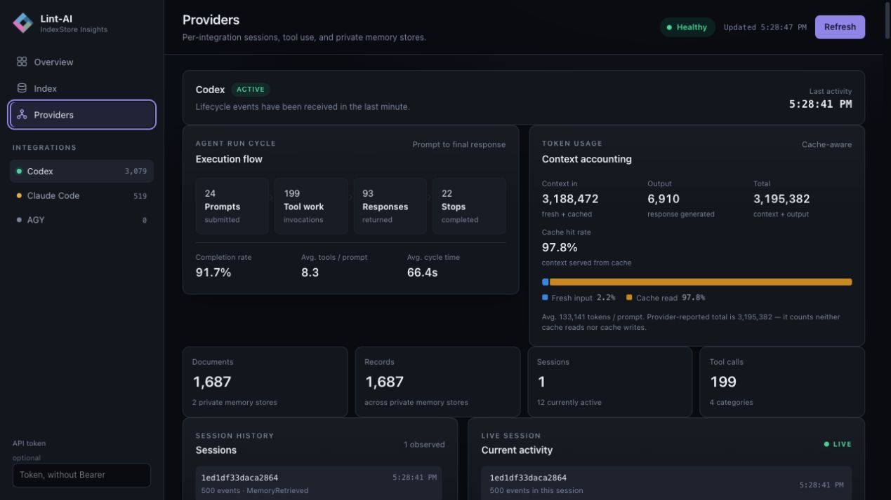

---
hide:
  - navigation
  - toc
---

<section class="hero">
  
LINT-AI · RELIABLE MEMORY &amp; INSIGHTS

  <h1>Reliable AI memory with insights you can trust.</h1>
  
<strong>Memory and insights for AI agents.</strong> Lint-AI turns project history — sessions, documents, decisions, traces, and code — into current, evidence-backed context, while showing what changed, what was superseded, and where the answer came from.

</section>

<section class="scenario" aria-label="Example of an agent retrieving a superseded decision">
  

    <article class="scenario-card scenario-card--complete">
      
OLDER EVIDENCE<time>ONCE RELEVANT</time>

      
“Increase retries to recover from the intermittent timeout.”

      <small>Topically relevant · no longer current</small>
    </article>
    
SUPERSEDED

    <article class="scenario-card scenario-card--empty">
      
CURRENT STATE<time>SUPPORTED BY NEWER EVIDENCE</time>

      
“Retries amplify load. Cap attempts and fix the token clock skew.”

      <small>Source-linked · time-aware · current</small>
    </article>
  

  

    Finding a relevant passage is not enough.
    <ol>
      <li><b>01</b> Relevance</li>
      <li><b>02</b> Recency</li>
      <li><b>03</b> Supersession</li>
      <li><b>04</b> Evidence</li>
    </ol>
  

  

    WITHOUT LINT-AI
    
Ordinary retrieval can surface an old recommendation as current because it is still topically relevant.

  

  

    WITH LINT-AI
    
The current state ranks first. Older guidance remains useful as history without quietly becoming today’s answer.

  

</section>

## What’s new in v0.2.0 {.landing-heading}

Lint-AI v0.2.0 helps AI agents find useful project context faster, keep working
while memory is updated, and use that memory more safely across different tools.

  <article>
    01
    <h3>Find the right memory faster</h3>
    
Projects are organized into searchable sections, so a query can start with
    the most relevant context and expand its search when needed.

  </article>
  <article>
    02
    <h3>Keep working during updates</h3>
    
Agents can continue searching a trusted snapshot while new memories are
    written and checked in the background.

  </article>
  <article>
    03
    <h3>Reliable memory, safer integrations</h3>
    
Validated updates, duplicate protection, and project boundaries keep memory
    dependable across Claude Code, Codex, Gemini CLI, and Antigravity CLI.

  </article>

Provider integrations remain opt-in. The default build stays lightweight, while <code>agent-integrations</code> enables all supported providers.

[Read the full v0.2.0 release notes](releases/0.2.0.md)

<section class="proof-grid" aria-label="Lint-AI benchmark highlights">
  
<strong>96.24%</strong>adaptive any-hit Recall@5

  
<strong>95.49%</strong>fixed any-hit Recall@5

  
<strong>1.25 ms</strong>fixed query latency

  
<strong>1,512.31/s</strong>v0.2.0 routed HTTP at C=10

</section>

v0.2.0 segmented benchmark · 133 multi-session questions · adaptive routing reached 96.24% any-hit Recall@5; fixed routing reached 95.49% at 1.25 ms average latency · Latest throughput is the cold-start median of five runs over 23,366 records on macOS M5 Pro; results vary by hardware and index layout

## See the dashboard {.landing-heading}

The local dashboard gives operators a live view of project indexes, segment layout, query activity, latency, errors, and provider telemetry across the agent integrations.

<section class="dashboard-slideshow" data-dashboard-slideshow aria-label="Lint-AI dashboard screenshots">
  

    

      <figure class="dashboard-slide is-active" data-dashboard-slide>
        
        <figcaption><strong>Overall</strong>Project health, query activity, and recent events</figcaption>
      </figure>
      <figure class="dashboard-slide" data-dashboard-slide>
        
        <figcaption><strong>Topology</strong>Segment routing and document distribution</figcaption>
      </figure>
      <figure class="dashboard-slide" data-dashboard-slide>
        
        <figcaption><strong>Provider</strong>Provider activity, sessions, and token usage</figcaption>
      </figure>
    

  

  

    <button type="button" data-dashboard-prev aria-label="Previous dashboard screenshot">←</button>
    

      <button type="button" class="is-active" data-dashboard-dot="0" role="tab" aria-selected="true">Overall</button>
      <button type="button" data-dashboard-dot="1" role="tab" aria-selected="false">Topology</button>
      <button type="button" data-dashboard-dot="2" role="tab" aria-selected="false">Provider</button>
    

    <button type="button" data-dashboard-next aria-label="Next dashboard screenshot">→</button>
  

</section>

## Prevent confident staleness {.landing-heading}

Agent context is not a pile of text. Decisions supersede older decisions. Terms drift. Ownership changes. The right answer often depends on *when* something was true and *where* the evidence came from.

  <article>
    01
    <h3>Know what is current</h3>
    
Rank current evidence ahead of older guidance and preserve historical answers when a question depends on the past.

  </article>
  <article>
    02
    <h3>Show why it is current</h3>
    
Return source, time, and relationship signals with the context so an agent or reviewer can inspect the basis for an answer.

  </article>
  <article>
    03
    <h3>Make drift visible</h3>
    
Surface contradictions, stale claims, terminology drift, orphan pages, and missing links before they become confident answers.

  </article>

## Keep your sources. Add a current-state memory layer. {.landing-heading}

Lint-AI does not ask you to discard your existing project knowledge. It indexes the sessions, notes, documents, and decisions you already have, then makes their relationships and history usable at retrieval time. Each provider gets isolated, project-scoped agent memory, lifecycle capture, and shared MCP controls.

  <a href="codex/"><strong>Codex</strong>Hooks, MCP, replay, project memory →</a>
  <a href="claude-code/"><strong>Claude Code</strong>Hooks, MCP, status line, replay →</a>
  <a href="gemini-cli/"><strong>Gemini CLI</strong>JSON hooks and shared MCP tools →</a>
  <a href="agy/"><strong>Antigravity CLI</strong>Gemini-compatible lifecycle protocol →</a>

## From corpus to grounded context {.landing-heading}

  
01<strong>Ingest</strong><small>Sessions · docs · code · traces</small>

  
02<strong>Understand</strong><small>Facts · entities · symbols · time</small>

  
03<strong>Connect</strong><small>Links · ownership · co-occurrence</small>

  
04<strong>Retrieve</strong><small>Ranked, sourced, current context</small>

<section class="final-cta">
  
Current-state agent memory for AI coding agents.

  <h2>AI memory that knows what is still true.</h2>
  <a class="md-button md-button--primary" href="quickstart/">Read the quickstart</a>
</section>
