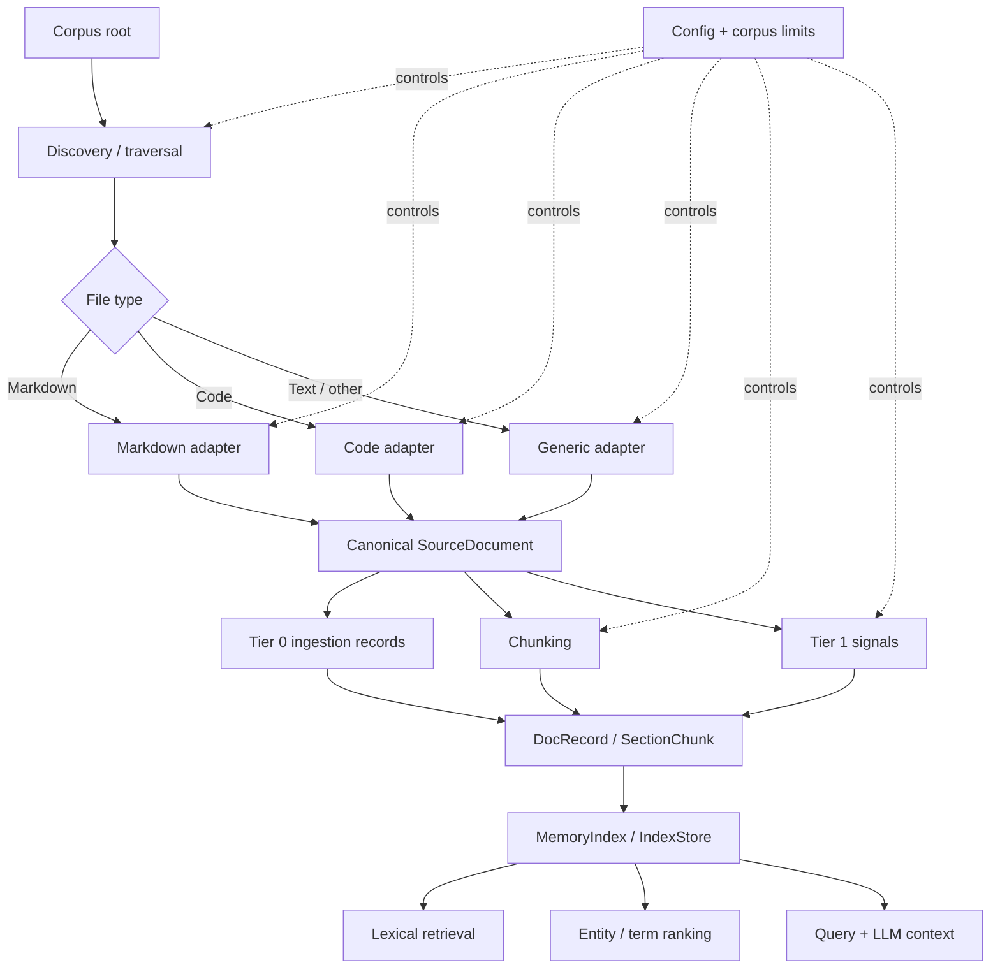

# Ingestion Architecture

This diagram shows the ingestion shape the repo should support once non-Markdown
sources are added. It keeps the current retrieval/indexing layers intact and
splits source handling into file-type-specific adapters.



## File ownership map

- [`src/graph.rs`](/home/louis/sources/Lint-AI/src/graph.rs): corpus traversal, page discovery, Tier 0 record generation
- [`src/source.rs`](/home/louis/sources/Lint-AI/src/source.rs): canonical source document shape
- [`src/chunking.rs`](/home/louis/sources/Lint-AI/src/chunking.rs): chunk boundaries and chunk enrichment
- [`src/tier1.rs`](/home/louis/sources/Lint-AI/src/tier1.rs): entity and important-term extraction
- [`src/pipeline.rs`](/home/louis/sources/Lint-AI/src/pipeline.rs): ingestion-to-index pipeline and store assembly
- [`src/index.rs`](/home/louis/sources/Lint-AI/src/index.rs): persistent query structures and retrieval state
- [`src/engine.rs`](/home/louis/sources/Lint-AI/src/engine.rs): CLI orchestration, cache handling, query flow

## Adapter design

The adapter boundary should return `SourceDocument` directly. We do not need a
separate intermediate `AdaptedDocument` shape yet.

Recommended trait shape:

```rust
pub struct AdapterInput<'a> {
    pub root: &'a std::path::Path,
    pub max_bytes: usize,
    pub max_files: usize,
    pub max_depth: usize,
    pub max_total_bytes: usize,
}

pub trait SourceAdapter {
    fn name(&self) -> &'static str;
    fn supports(&self, path: &std::path::Path) -> bool;
    fn ingest(
        &self,
        input: &AdapterInput<'_>,
    ) -> anyhow::Result<Vec<lint_ai::SourceDocument>>;
}
```

The main change needed for code support is to replace the single Markdown-only
discovery path with a dispatcher that chooses an adapter by extension or file
kind, then normalizes every source into `SourceDocument`.
