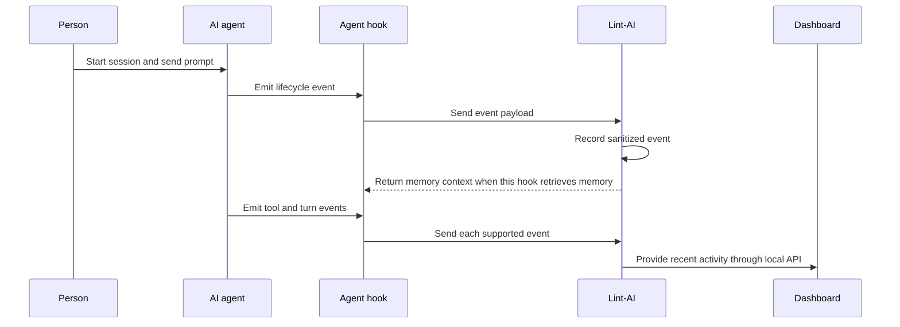

# Observability

See how Lint-AI is working across your project and connected agents. The local
dashboard brings memory index health, search activity, and provider activity
together in one place.

## Dashboard

When the Lint-AI server is running, open
[`http://127.0.0.1:8080/dashboard`](http://127.0.0.1:8080/dashboard).

### Start the dashboard

From a Lint-AI source checkout, start the local server for a project. This
example includes Claude Code and Codex provider views:

```bash
cargo run --release --bin server --features claude-code,codex -- \
  --project-root /path/to/project \
  --bind 127.0.0.1:8080 \
  --allow-unauthenticated
```

Replace `/path/to/project` with the project directory. Then open
[`http://127.0.0.1:8080/dashboard`](http://127.0.0.1:8080/dashboard). The
server discovers the project's `.lint-ai/` data and the dashboard shows
separate provider views when their features are compiled and their integrations
have reported activity. See the [HTTP server guide](server.md) for server
options and API behavior.

<section class="dashboard-slideshow" data-dashboard-slideshow aria-label="Lint-AI dashboard screenshots">
  <div class="dashboard-slideshow__stage">
    <div class="dashboard-slideshow__track">
      <figure class="dashboard-slide is-active" data-dashboard-slide>
        
        <figcaption><strong>Overview</strong><span>Project health, query activity, and recent events</span></figcaption>
      </figure>
      <figure class="dashboard-slide" data-dashboard-slide>
        
        <figcaption><strong>Memory index</strong><span>Index health, freshness, and segment layout</span></figcaption>
      </figure>
      <figure class="dashboard-slide" data-dashboard-slide>
        
        <figcaption><strong>Agent activity</strong><span>Provider activity, sessions, and available usage data</span></figcaption>
      </figure>
    </div>
  </div>
  <div class="dashboard-slideshow__controls">
    <button type="button" data-dashboard-prev aria-label="Previous dashboard screenshot">←</button>
    <div class="dashboard-slideshow__dots" role="tablist" aria-label="Dashboard screenshot views">
      <button type="button" class="is-active" data-dashboard-dot="0" role="tab" aria-selected="true">Overview</button>
      <button type="button" data-dashboard-dot="1" role="tab" aria-selected="false">Memory index</button>
      <button type="button" data-dashboard-dot="2" role="tab" aria-selected="false">Agent activity</button>
    </div>
    <button type="button" data-dashboard-next aria-label="Next dashboard screenshot">→</button>
  </div>
</section>

The dashboard refreshes every five seconds. It shows:

- **Memory index health:** freshness, revisions, and segment counts.
- **Search performance:** recent request rates, latency, errors, and empty results.
- **Agent activity:** observed providers, recent sessions, lifecycle events, and
  tool activity when the connected agent reports it.
- **Usage:** token counts when available from the agent's hooks or transcripts.

## Agent lifecycle and events

An agent lifecycle is the sequence of events while someone uses an agent: a
session starts, a prompt arrives, tools run, a turn finishes, and eventually
the session ends. The agent host emits these events. Lint-AI does not poll the
agent or invent its own lifecycle events.

When you install an integration, it registers Lint-AI with the host's hook
system. At the appropriate point, the host sends a small event payload to the
Lint-AI hook command or plugin callback. Lint-AI records a bounded, sanitized
event for the dashboard. Some hooks also look up memory or save a useful
outcome; many just report that something happened.



The event names differ by agent because each host has its own hook system.
These are examples of events Lint-AI can receive:

| Agent | Events Lint-AI can receive |
|---|---|
| Claude Code | `SessionStart`, `UserPromptSubmit`, `PreToolUse`, `PostToolUse`, `PreCompact`, `Stop`, `SessionEnd`, and subagent events |
| Codex | `SessionStart`, `UserPromptSubmit`, `PreToolUse`, `PostToolUse`, `PreCompact`, `PostCompact`, `Stop`, `SessionEnd`, and subagent events |
| Gemini CLI | `SessionStart`, `BeforeAgent`, `AfterAgent`, `BeforeModel`, `BeforeTool`, `AfterTool`, `PreCompress`, `SessionEnd` |
| Antigravity CLI | `PreToolUse`, `PostToolUse`, `PreInvocation`, `PostInvocation`, `Stop` |
| OpenClaw | `agent:bootstrap`, `agent_end`, `before_reset`, `session_start`, `session_end`, `shutdown` |
| Muse Code | `SessionStart`, `UserPromptSubmit`, tool-use events, `Stop`, `SessionEnd` |
| Hermes | Its optional hooks plugin captures memory activity, but does not currently send lifecycle events to this telemetry dashboard. |

For example, a prompt event can trigger a memory lookup, while an end-of-turn
event can save an outcome for a later session. The exact hooks that retrieve or
save memory vary by agent; the [agent lifecycle guide](agents.md) explains
those differences.

Lifecycle telemetry is separate from full session recording. It stores
bounded event details for the dashboard; it does not copy the full conversation
transcript. Session recording is a separate feature for keeping events for
replay and inspection. See [telemetry details](telemetry.md) for what is
stored and how long it is retained.

Provider state is based on events actually received. An agent may be installed
but show no recent activity until its hooks or MCP connection send an event.
Token usage also depends on what that agent makes available.

## Local data and privacy

Query statistics are bounded and do not store query text, session IDs, or memory
content. Provider activity is stored in bounded local ledgers under
`.lint-ai/provider-telemetry/`; selected events can contain short, redacted
previews. Full session recording is a separate feature. See
[telemetry details](telemetry.md) for coverage, retention, and file-watcher
behavior.

The dashboard itself is read-only. Its page can load before you enter an API
token, while its data endpoints use the server's configured authentication.
Keep the server on localhost as described in the
[HTTP server guide](server.md).

## Metrics and integrations

The server also exposes aggregate metrics for monitoring tools:

| Endpoint | What it reports |
|---|---|
| `GET /api/status` | Index state, query summary, and integration status |
| `GET /api/timeseries` | Recent query counts and latency summaries |
| `GET /api/integrations` | Provider readiness and observed state |
| `GET /api/sessions` and `GET /api/events` | Recent sanitized provider activity |
| `GET /api/metrics` | Machine-readable JSON metrics |
| `GET /metrics` | Prometheus-format metrics |

The same query, agent activity, and memory index summaries are available to
Prometheus through `GET /metrics`. See [Prometheus](prometheus.md) for scrape
configuration, the metric list, and which dashboard details stay in the event
view. Lint-AI exposes Prometheus metrics today; it does not currently export
OpenTelemetry OTLP data.

See the [server setup](server.md) to start the dashboard, and
[telemetry details](telemetry.md) for event coverage and data handling.
