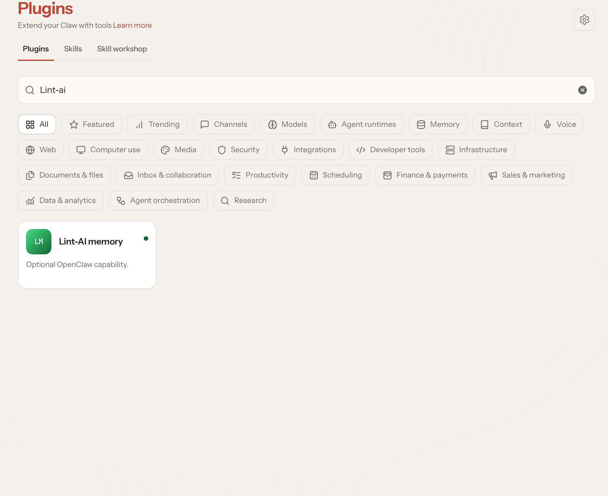
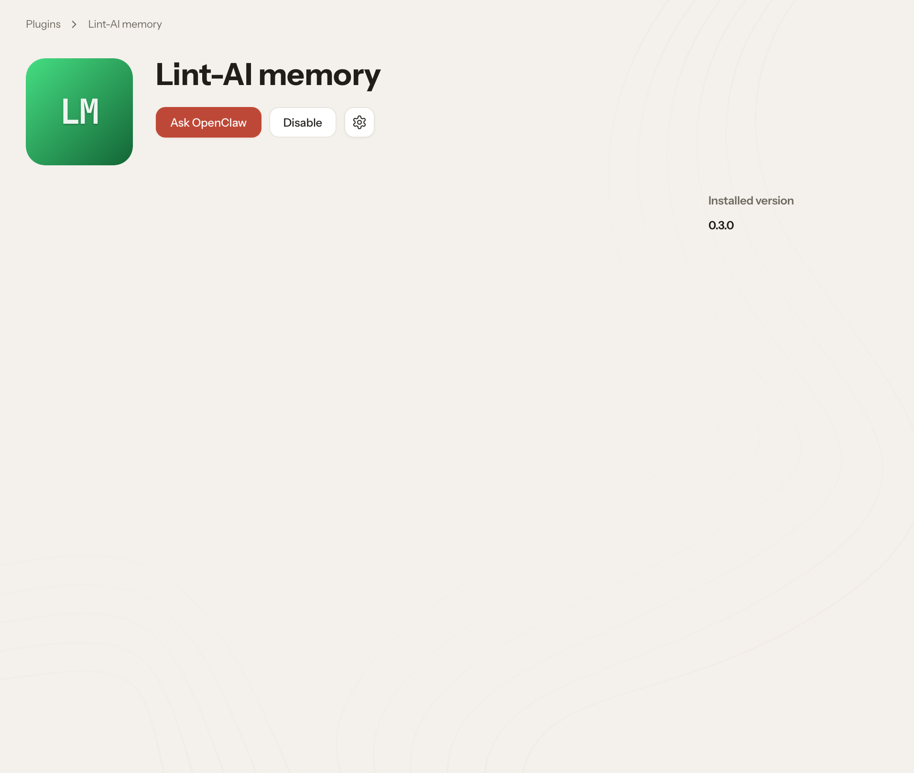
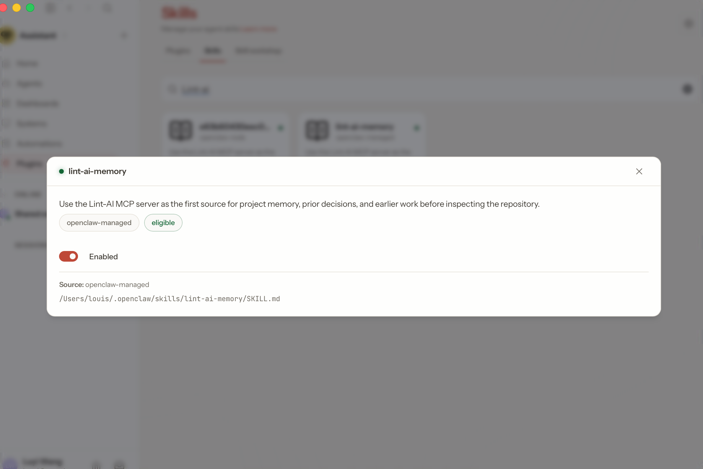
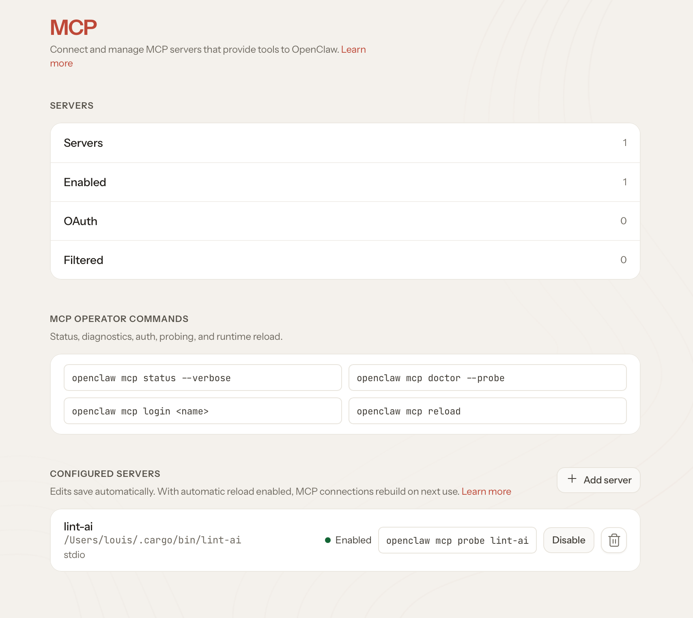

# Set up Lint-AI with OpenClaw

Connect Lint-AI to an OpenClaw project so your agents can use useful
information from earlier work. Lint-AI can bring relevant memories into a run
and save outcomes for later.

## 1. Install Lint-AI

On macOS or Linux, install the latest release with:

```bash
curl -fsSL https://raw.githubusercontent.com/RooAGI/Lint-AI/main/scripts/install.sh | sh
```

On Windows, download the latest `lint-ai-windows-x86_64.exe` from the
[releases page](https://github.com/RooAGI/Lint-AI/releases/latest). Run it as
`lint-ai-windows-x86_64.exe` in the commands below.

## 2. Connect it to your project

Open a terminal in your project folder and run:

```bash
lint-ai --openclaw-install .
```

This adds Lint-AI to OpenClaw and installs its memory skill. It preserves your
other OpenClaw settings, and it is safe to run again if you need to update the
setup.

## 3. Restart OpenClaw and check the connection

Restart your OpenClaw Gateway so it loads the new settings, then run:

```bash
lint-ai --openclaw-verify-mcp
```

This checks that the Lint-AI server starts and offers its MCP tools. The
`lint-ai-memory` skill is separate: it gives OpenClaw instructions for using
memory, but does not provide callable tools by itself. OpenClaw must load the
enabled `lint-ai` MCP server for those tools to appear in a conversation.

Check the connection from OpenClaw as well:

```bash
openclaw mcp status --verbose
openclaw mcp probe lint-ai
```

If the server is enabled but the tools are missing from a conversation, first
check that OpenClaw's tool rules allow them. In the active conversation, open
**+ → Connectors → Tool access** and look for the Lint-AI tools. OpenClaw's
agent profile, allow/deny rules, or sandbox settings can hide tools even when
the server is connected. For sandboxed runs, OpenClaw's sandbox tool allowlist
must also allow MCP tools.

Lint-AI provides callable MCP tools, such as `lint-ai__search`; it does not
currently publish MCP resources. An empty resource catalog is therefore
expected and does not mean the Lint-AI connection failed.

After changing connection or tool settings, reload the MCP connection and
start a new conversation:

```bash
openclaw mcp reload
```

Start an agent run in the project and ask about a previous decision or outcome.
You can also ask the agent to save an important result for later. Lint-AI's
memory tools are available to the agent after setup.

### Screens that show setup is ready

The OpenClaw menus can look different between versions. These screenshots
show the expected Lint-AI entries. Open each one to see the full image.

??? note "1. Find Lint-AI memory in the Plugins catalog"

    

??? note "2. Confirm the Lint-AI plugin is installed"

    

??? note "3. Confirm the Lint-AI memory skill is enabled"

    

??? note "4. Confirm the lint-ai MCP server is enabled"

    

## What setup adds

Lint-AI adds three things to OpenClaw:

- **Memory lookup:** relevant project memories can be added when an agent run
  starts.
- **Memory capture:** useful outcomes and session summaries can be saved as
  work finishes.
- **Memory tools:** the agent can search and manage memories when needed.

These additions work alongside OpenClaw's own notes and memory files. Lint-AI
stores project memories in `.lint-ai/memory/`, shared with other connected
agents in the same project.

## If it does not work

- If the verification command fails, confirm `lint-ai` is installed and on
  your `PATH`, then run `lint-ai --openclaw-install .` again.
- If the agent does not recall memories, make sure the OpenClaw Gateway was
  restarted after installation and that you started the agent from the project
  where you installed Lint-AI.
- If OpenClaw uses a custom state directory, make sure the Gateway and the
  installer are using the same directory.

For setup with other agents, see [Connect your AI agent](connect-agent.md).
