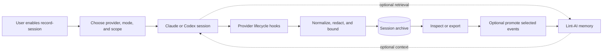

# Session Recording Design

## Status

Proposed.

This document defines an explicit, opt-in session recorder for Claude Code and
Codex integrations. It is intentionally separate from Lint-AI memory
retrieval: a user can record a session without allowing Lint-AI to inject
context into that session.

## Motivation

Lint-AI currently captures bounded, structured memories from lifecycle hooks.
Those memories are optimized for future retrieval and are not a complete audit
of what happened during a session.

Users need a safe way to:

- record one Claude or Codex session;
- inspect or export what was recorded;
- run a clean A/B comparison against native memory;
- collect a session for debugging or evaluation without changing agent
  behavior; and
- decide later whether selected material should become durable Lint-AI memory.

## Goals

- Support Claude Code and Codex through one provider-neutral recording model.
- Make recording project-scoped, defaulting on when the user explicitly enables
  Lint-AI while preserving an independent recording override.
- Preserve ordered session events as append-only JSONL.
- Record prompts, assistant output, tool calls, tool results, and lifecycle
  metadata when the provider exposes them.
- Redact common credentials and sensitive key material before persistence.
- Keep recording independent from retrieval, MCP, and memory injection.
- Make interrupted sessions readable and recoverable.
- Support reproducible A/B experiments with isolated settings and storage.

## Non-goals

- Recording sessions globally without explicit user configuration.
- Treating every recorded event as durable memory automatically.
- Reconstructing provider-internal state that is not present in hook payloads.
- Capturing arbitrary filesystem contents or environment variables.
- Replacing the provider's own transcript, audit, or observability systems.
- Guaranteeing that a provider exposes every event for every client version.

## User-facing modes

Recording and retrieval are independent controls.

| Mode | Record events | Retrieve/inject Lint-AI memory | Native provider memory |
| --- | --- | --- | --- |
| `off` | No | No change | No change |
| `capture-only` | Yes | No | No change |
| `assist` | Yes | Yes | Configurable |
| `ab` | Yes, isolated per arm | Configurable per arm | Configurable per arm |

The default remains `off` until the user explicitly enables Lint-AI or starts
recording. Enabling Lint-AI turns recording on by default; `capture-only` is
the recommended first-run mode.

An A/B run must use fresh sessions and separate recording/memory directories.
The primary comparison is:

- Arm A: native provider memory only;
- Arm B: Lint-AI recording and/or retrieval with native memory disabled; and
- optional Arm C: both layers enabled.

The same prompt, repository revision, model, and tool permissions should be
used for each arm.

## User-facing visualization

The user should be able to understand the recorder without reading the event
schema. The primary visualization is a short lifecycle with two independent
branches: recording goes to the session archive, while retrieval is optional
and goes to the agent context.



The enablement view should make these choices visible before the session
starts:

```text
Record session

Provider       Claude Code
Mode           Capture only
Project        /work/project
Session root   .lint-ai/claude-sessions
Retrieval      Off
Native memory  Unchanged
Redaction      Default policy

[Start recording]    [Cancel]
```

During the session, the interface should show a quiet, non-blocking indicator
such as `Recording: Claude · capture-only`. It should not display every event
or interrupt the agent. A detailed event stream belongs in the inspection
view.

The Claude Code integration implements this through Claude's native persistent
`statusLine`: when no user-defined status line exists, installation adds a
command that renders `Lint-AI:ON | Record:OFF` (or the corresponding states).
The command reads the active project from Claude's status-line JSON input, so
the indicator remains project-scoped, and existing Claude status lines are
preserved. Codex does not currently expose an equivalent arbitrary command
status-line hook. The Codex integration still exposes the same compact status
through `mcp__lint-ai__lint_ai_status` and the hidden
`--codex-statusline` renderer for external terminal/status-bar integrations.

After the session, show one compact result with clear next actions:

```text
Session recorded

Claude · capture-only · 12m 08s
47 events · 38.2 KB · 6 redactions · complete
Saved to .lint-ai/claude-sessions/claude-abc123/

[Inspect]  [Export]  [Promote to memory]  [Delete]
```

For A/B testing, the visualization should make isolation explicit rather than
presenting one blended timeline:

```text
                         Same task
                            |
             +--------------+--------------+
             |                             |
       Arm A: native                 Arm B: Lint-AI
       native memory                 capture/retrieval
       archive A                     archive B
             |                             |
             +--------------+--------------+
                            |
                    Compare results
```

The comparison view should report only decision-relevant measures: answer
quality, latency, token usage, injected-context bytes, recorded event count,
and redaction count. It should always label the provider, model, repository
revision, settings root, and session root for each arm.

## Replay sessions

A replay is always a new, recorded provider session. Replay recording is
mandatory because the comparison needs an observable record of the replay's
prompts, tool calls, outputs, usage, and timing.

```text
baseline session A                    replay session B
Lint-AI disabled                      Lint-AI enabled
recorded archive                      recorded archive
        |                                      |
        +----------- compare A and B ----------+
```

The replay must:

1. create a fresh provider `session_id`;
2. create a fresh Lint-AI recording directory;
3. run with isolated provider settings and memory roots;
4. associate the new session with `replay_of_session_id`;
5. record the replay regardless of whether Lint-AI retrieval is enabled; and
6. leave the baseline archive and memory segment unchanged.

Replay should be implemented by an orchestrator that starts a new provider
process. Hooks observe and record the new session, but hooks do not themselves
replay a conversation. A Claude session fork is not equivalent to a clean
replay because it copies the existing conversation history. A clean replay
must start from the original task/prompt with a new session identity.

The replay manifest includes relationship and experiment metadata:

```json
{
  "session_id": "replay-b",
  "replay_of_session_id": "baseline-a",
  "run_type": "replay",
  "arm": "claude-lint-ai",
  "lint_ai_enabled": true,
  "recording_enabled": true
}
```

The baseline manifest is immutable. Multiple replay attempts may reference the
same baseline, each with a distinct provider session ID and recording archive.

The implemented command surface is:

```text
lint-ai --replay-session baseline-a \
  --session-provider claude \
  --replay-enable-lint-ai
```

For the no-memory arm, use `--replay-disable-lint-ai`. It is also the default
when neither replay toggle is supplied.

The command extracts all recorded user prompts. For Codex, it launches a
fresh non-interactive provider process (`codex exec`) for the first prompt and
resumes that provider conversation for subsequent prompts. Claude print mode
currently runs each prompt as a fresh non-interactive process because it does
not expose a portable resume API. The command creates a new `replay-*`
session ID and records provider hooks and replay output in that archive by
passing the replay ID through the hook environment. It restores the prior
memory and recording toggles after the provider exits and returns the replay
session ID and archive path for later comparison.

## Load a recorded session into a scenario

A recorded session can be promoted into a benchmark scenario for structured
review. The session remains the immutable evidence source; the scenario adds
the review contract. This avoids putting expectations, validators, or grading
decisions into the raw event archive.

```text
recorded session
  | import/reference
  v
scenario fixture
  | add expected facts, validators, and performance limits
  v
scenario runner
  | evaluate baseline, replay, or both
  v
review report
```

The scenario should reference the source session instead of copying its full
event log:

```json
{
  "schema_version": 1,
  "id": "review-session-abc123",
  "category": "session-review",
  "source_session": {
    "provider": "claude",
    "session_id": "abc123",
    "archive": ".lint-ai/claude-sessions/abc123",
    "repository_revision": "abc123"
  },
  "setup_messages": [
    {"prompt": "...", "establishes_fact_ids": []}
  ],
  "continuation_prompt": "...",
  "expected_facts": [],
  "validators": [],
  "limits": {
    "max_duration_seconds": 600,
    "max_output_tokens": 4000
  }
}
```

Loading a session into a scenario should derive the initial
`setup_messages` and continuation prompt from recorded user-prompt events,
retain the source session metadata, and leave `expected_facts`, `validators`,
and `limits` editable. The user can then add facts such as “the answer names
IndexStore” or validators such as a test command before running the review.

The existing scenario fields remain the evaluation interface:

- `expected_facts` checks whether the final response contains required facts;
- `forbidden_facts` checks for regressions or disallowed claims;
- `validators` runs repository or artifact checks; and
- `limits` evaluates duration, token usage, injected context, and other
  performance budgets.

The scenario runner may evaluate the original recorded output, a replay
output, or both. A comparison report should identify the source session and
replay session while keeping the same scenario expectations and validators for
each arm. Evaluation results belong in a separate result artifact and must not
modify either the session archive or the scenario definition.

An eventual import command can be exposed as:

```text
lint-ai --scenario-from-session abc123 \
  --session-provider claude \
  --scenario-out benchmark/claude_code/scenarios/review-session-abc123.json
```

### Activation inside Claude or Codex

After the provider integration is installed, recording remains dormant until
the user explicitly enables Lint-AI or starts it from the active provider
session through the Lint-AI MCP control tool:

```json
{"action":"start"}
```

The tool is named `mcp__lint-ai__record_session` in the client. Stopping uses
`{"action":"stop"}`, and checking the state uses `{"action":"status"}`.

The provider skill and tool description must make these rules explicit:

- enabling Lint-AI starts recording by default, or recording can be started
  directly with `record_session`;
- starting recording is capture-only and does not inject memory;
- recording is scoped to the current project and provider; and
- the user can stop recording without disabling memory or reinstalling hooks.

The agent must never start recording as a side effect of a normal search,
memory lookup, or repository task. If the MCP server is unavailable, the user
can use the equivalent local state command in a future CLI surface; the first
implementation does not silently fall back to recording.

## `record-session` process

The recorder is a local event sink attached to the provider's lifecycle hooks.
It does not become an agent, proxy, MCP server, or tool-policy decision maker.
Its normal operation is:

```text
enable recording
      |
      v
open or recover session
      |
      v
receive provider hook --> normalize --> redact --> bound --> append event
      |                                      |
      |                                      +--> fail open if recording fails
      v
finalize on session end
      |
      v
inspect/export later
      |
      v
optional explicit promotion into memory
```

### 1. Enable recording

Recording is enabled before the provider session starts. Installation writes
only the selected provider's hooks into the selected settings scope and stores
the recording mode and session root in the generated configuration.

The command must report:

- provider and project scope;
- recording mode;
- session root;
- whether retrieval/injection is enabled; and
- the redaction and size-limit policy.

The command must require confirmation for a non-temporary session root unless
the user has supplied an explicit non-interactive flag. `capture-only` should
be the default when `--record-session` is used without a retrieval mode.

### 2. Open or recover the session

On the first lifecycle event, the provider adapter derives a session identity
from the provider session/thread identifier. If the provider identifier is
missing, the adapter creates a random local identifier and records that the
identity is locally assigned.

The recorder then:

1. resolves the configured project root without following an unsafe path;
2. creates the provider-specific session directory;
3. creates `manifest.json` with status `active`;
4. opens or creates `events.jsonl`; and
5. acquires the session writer lock.

If an existing active session has the same identity, the recorder treats the
event as a retry or continuation. It does not silently merge unrelated
sessions with similar prompts or repository paths.

### 3. Normalize the provider event

Each Claude or Codex hook adapter maps its payload into one normalized event.
The adapter must preserve provider identifiers such as session, thread, turn,
rollout, tool, and agent IDs when available.

The adapter should record the smallest useful payload for the event:

- prompt events retain prompt text and prompt metadata;
- assistant events retain assistant text and message metadata;
- tool calls retain tool name and bounded input;
- tool results retain tool name, bounded result, and success/failure state;
- compaction events retain compaction metadata and any bounded summary; and
- lifecycle events retain timestamps, reason, and status.

The adapter must not copy a provider's entire opaque payload by default.
Unknown fields are retained only under the bounded `provider_event` policy.

### Usage metadata

Usage is recorded opportunistically and must carry its provenance. Claude Code
currently exposes detailed usage for completed `Agent` subagent calls in the
`PostToolUse` tool response, including `totalTokens` and input/output/cache
breakdowns. The recorder normalizes those fields into the event envelope as
`usage` with source `hook-payload`.

Claude's ordinary lifecycle hook payloads do not provide a general per-turn
usage object, but the hook input includes `transcript_path`. At `Stop`, the
adapter reads the latest usage object from that transcript and appends a
`turn_usage` event with source `claude-transcript` when available.

Codex's exact token usage is exposed by its app-server as the
`thread/tokenUsage/updated` notification, not by the lifecycle hook payload.
The hook adapter therefore uses transcript-derived usage when the Codex
transcript exposes it. The planned app-server adapter will subscribe to the
notification and append the same `turn_usage` event shape with source
`codex-app-server`.

Comparison tools must label usage as `hook-payload`, `claude-transcript`,
`codex-transcript`, `codex-app-server`, or `unavailable`.

### 4. Redact and bound the event

Redaction happens before size measurement and before any serialization to disk.
The pipeline is:

```text
provider payload
  -> extract supported fields
  -> recursively redact sensitive keys and values
  -> truncate strings and arrays to policy limits
  -> enforce maximum event bytes
  -> serialize normalized envelope
```

If the event still exceeds the maximum size after field-level truncation, the
recorder drops the lowest-priority optional fields and records the omitted
field names in the envelope. It must never write an unredacted fallback.

### 5. Append the event

The recorder obtains the per-session writer lock, checks the event ID for
deduplication, assigns the next sequence number, appends one JSON object plus a
newline, flushes the writer, and releases the lock.

The append operation is the durability boundary. A hook may return after the
event has been flushed or after the configured short write deadline expires.
The provider session must continue even if the deadline is exceeded.

The recorder updates lightweight manifest counters after a successful append.
Counter updates are advisory; `events.jsonl` is the source of truth and can be
rescanned by inspection or recovery.

### 6. Finalize the session

The first terminal event (`session_end`, or the provider's equivalent) causes
the recorder to:

1. append the terminal event;
2. flush and close the event writer;
3. compute event count, byte count, and optional checksum metadata;
4. set `ended_at` and terminal status in the manifest; and
5. release the writer lock.

Terminal hooks are idempotent. A retry must not append a second terminal event
with a new sequence number unless the retry contains a distinct event ID and
new provider state.

If a provider emits `Stop` but not `SessionEnd`, `Stop` is recorded as a normal
event and the session remains active until recovery or explicit finalization.
The inspection command may mark such a session `incomplete`; it must not
rewrite the event history.

### 7. Recover interrupted sessions

Recovery runs when a session is opened, listed, inspected, or explicitly
repaired. It:

1. acquires the writer lock;
2. scans `events.jsonl` in order;
3. keeps complete valid lines;
4. removes only an incomplete final line caused by an interrupted write;
5. detects duplicate or non-monotonic sequence numbers;
6. rebuilds advisory manifest counters; and
7. marks an active session `incomplete` if its process ended without a terminal
   event.

Recovery must not discard a valid event because a later event is malformed.
Malformed non-final lines are reported in inspection output and preserved in a
separate recovery diagnostic rather than silently rewritten.

### 8. Inspect and export

Inspection is read-only and never changes an active session. It reports the
manifest, event summary, redaction count, truncation count, incomplete-line
status, and provider capabilities.

Export reads the manifest and valid event envelopes in sequence order. It can
produce JSONL or a human-readable Markdown summary, but both formats must use
the already-redacted data. Export must not re-read provider transcripts to
recover data that was intentionally omitted during recording.

### 9. Promote selected material into memory

Recording does not automatically create Lint-AI memory records. Promotion is a
separate user action:

1. select a session or event range;
2. show a redacted preview;
3. allow the user to exclude events or fields;
4. convert the selection through the existing Claude/Codex document adapter;
5. write durable memory with a source link to the recorded session; and
6. report the created document IDs.

Promotion must be idempotent for the same session ID, event range, and memory
schema version. Deleting a recording must not delete promoted memory unless a
future explicit cascade policy is enabled.

## Configuration

The exact CLI surface may evolve, but the configuration needs equivalent
controls to the following:

```text
lint-ai --claude-code-install /path/to/project \
  --session-recording capture-only \
  --session-root /path/to/project/.lint-ai/claude-sessions

lint-ai --codex-install /path/to/project \
  --session-recording capture-only \
  --session-root /path/to/project/.lint-ai/codex-sessions
```

For experiments, settings and storage must be supplied explicitly or created
under a disposable directory:

```text
lint-ai --claude-code-install /path/to/project \
  --session-recording ab \
  --experiment-root /tmp/lint-ai-experiment/run-1
```

Installation must not silently overwrite global provider settings. It should
prefer project-local settings or require an explicit settings path. Existing
unrelated hooks, MCP servers, and settings remain untouched.

## Storage layout

Each provider and project has an independent session root:

```text
.lint-ai/
  claude-sessions/
    <session-id>/
      manifest.json
      events.jsonl
      checksums.json
  codex-sessions/
    <session-id>/
      manifest.json
      events.jsonl
      checksums.json
```

Session roots should be ignored by Git by default. A user may explicitly
export a session into a tracked or external location.

### Manifest

`manifest.json` contains stable metadata and lifecycle state:

```json
{
  "schema_version": 1,
  "session_id": "claude:abc123",
  "provider": "claude",
  "project_root": "/work/project",
  "started_at": "2026-08-08T12:00:00Z",
  "ended_at": null,
  "status": "active",
  "recording_mode": "capture-only",
  "repository_revision": "abc123",
  "repository_branch": "main",
  "event_count": 4,
  "redaction_policy": "default-v1"
}
```

The recorder updates the manifest atomically when possible. A missing or
stale `ended_at` does not invalidate the event log; interrupted sessions have
status `incomplete` after recovery or inspection.

### Event log

`events.jsonl` contains one envelope per event. The envelope is provider
neutral, while `payload` retains only the normalized fields needed for replay,
inspection, and analysis.

```json
{
  "schema_version": 1,
  "sequence": 7,
  "event_id": "evt-7",
  "timestamp": "2026-08-08T12:01:03Z",
  "kind": "tool_result",
  "provider": "claude",
  "session_id": "claude:abc123",
  "turn_id": "turn-42",
  "payload": {
    "tool_name": "Bash",
    "input": {"command": "cargo test"},
    "response": {"output": "test result: ok"}
  },
  "redactions": ["payload.response.output.secret"]
}
```

Supported normalized event kinds are:

- `session_start`;
- `user_prompt`;
- `assistant_message`;
- `tool_call`;
- `tool_result`;
- `tool_error`;
- `compaction`;
- `subagent_start`;
- `subagent_stop`; and
- `session_end`.

Unknown provider events are recorded as `provider_event` only when their
payload passes the redaction and size limits. Unknown fields must not prevent
the session from being recorded.

## Provider adapters

The recorder owns the normalized event model. Provider integrations only map
their hook payloads into events.

### Claude Code

The Claude adapter maps lifecycle hooks as follows:

| Hook | Recording behavior |
| --- | --- |
| `SessionStart` | Open or recover the session manifest |
| `UserPromptSubmit` | Append `user_prompt` |
| `UserPromptExpansion` | Append the expanded prompt metadata |
| `PreToolUse` | Append `tool_call` when available |
| `PostToolUse` | Append `tool_result` |
| `PostToolUseFailure` | Append `tool_error` when available |
| `PreCompact` | Append `compaction` |
| `SubagentStart` | Append `subagent_start` |
| `SubagentStop` | Append `subagent_stop` |
| `Stop` | Append final assistant/session state |
| `SessionEnd` | Append `session_end` and finalize the manifest |

`Stop` and `SessionEnd` must be idempotent because providers may retry hooks.

### Codex

The Codex adapter maps the corresponding rollout and hook payloads into the
same event kinds. It must preserve the provider's turn, thread, rollout, and
agent identifiers when present so events can be correlated without storing
provider-specific state in the core recorder.

If a provider does not expose a particular event, the recorder does not infer
it from unrelated fields. The manifest records provider capability information
for accurate interpretation.

## Privacy and safety

Recording is potentially sensitive and must be treated as user data.

Before an event is written:

- redact API keys, bearer tokens, private-key blocks, passwords, cookies, and
  common secret environment-variable values;
- omit raw environment dumps and process tables;
- cap individual strings, nested JSON values, event size, and total session
  size;
- preserve a redaction marker rather than silently changing the event shape;
- never log the unredacted payload on errors; and
- fail open for the agent session: recorder failures must not block Claude or
  Codex.

The default retention policy is local storage with no upload. Cleanup and
export commands must make the destination explicit. The CLI should display a
warning before enabling recording and provide a clear way to disable it.

## Reliability and concurrency

- Append events with one writer per session where possible.
- Use a lock or atomic claim file when multiple hook processes can write the
  same session.
- Assign sequence numbers under the same lock as the append.
- Flush each event before acknowledging the hook when practical.
- Recover by scanning valid JSONL lines and truncating only an incomplete final
  line.
- Treat duplicate `event_id` values as replays and ignore them.
- Keep hook latency bounded; large payloads are truncated before serialization.

The recorder should expose timing counters so A/B runs can measure recording
overhead separately from retrieval and MCP startup.

## Inspection and export

Provide read-only commands for local review:

```text
lint-ai --list-sessions /path/to/project
lint-ai --inspect-session <session-id> --session-root .lint-ai/claude-sessions
lint-ai --export-session <session-id> --format jsonl --out session.jsonl
```

Inspection should show event counts, duration, provider, recording mode,
redaction count, completion status, and storage path without printing secrets.
Export should preserve the normalized event order and include the manifest.

Converting a recorded event into durable memory is a separate, explicit
operation. The first version should support selecting a session or event
range, applying the same redaction and bounded-content rules, and importing
through the existing provider document adapters.

## A/B experiment workflow

1. Create two disposable settings roots and two session/memory roots.
2. Run the same setup session in each arm, or seed each arm identically.
3. Start fresh continuation sessions.
4. Run the identical task prompt.
5. Collect the event logs, hook timings, injected-context bytes, latency, token
   usage, and task-quality scores.
6. Compare results without merging the memory stores.
7. Delete temporary roots after exporting the artifacts needed for analysis.

The benchmark runner should use this workflow rather than modifying the
developer's global Claude or Codex configuration.

## Implementation phases

### Phase 1: recorder core

- Add the normalized event envelope and manifest types.
- Add append-only JSONL writing, size limits, locking, recovery, and redaction.
- Add inspection tests for replay, duplicate events, truncation, and crash
  recovery.

### Phase 2: provider adapters

- Add Claude lifecycle mapping, including tool and subagent events.
- Add Codex lifecycle mapping.
- Keep capture-only mode independent from retrieval.
- Add provider capability metadata.

### Phase 3: CLI and experiments

- Add explicit recording configuration and session-root selection.
- Add list/inspect/export commands.
- Update benchmark arms to use isolated settings and recorder roots.
- Add end-to-end A/B fixtures.

### Phase 4: memory promotion

- Add explicit session-to-memory import.
- Reuse provider document normalization and secret filtering.
- Measure whether promoted records improve retrieval without increasing noise.

## Acceptance criteria

- Recording is off unless explicitly enabled.
- A user can record one Claude or Codex session without memory injection.
- A replay always creates a fresh provider session ID and records it.
- A replay manifest links back to its immutable baseline session.
- Claude and Codex events use the same normalized event schema.
- Replayed stop/end hooks do not duplicate events or memory records.
- Interrupted sessions remain inspectable.
- Secrets and private-key blocks are redacted before disk persistence.
- Recording failures do not interrupt the provider session.
- A/B runs do not modify global provider settings or share memory roots.
- Inspection and export never emit the original unredacted payload.
- Session recording and durable-memory promotion are separate operations.
