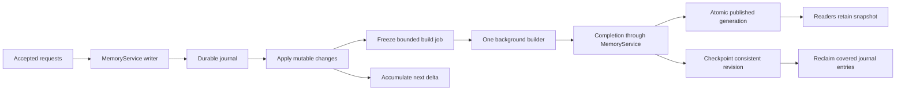

# Incremental write publication plan

Status: implementation in progress. An active Codex goal tracks implementation and verification.
The background builder and revision barriers are implemented. Capture and
checkpoint serialization costs remain under investigation as described below.

## Objective and baseline

Reduce sustained write cost and acknowledgement stalls while preserving durable
acceptance, atomic query generations, idempotent retries, and crash recovery.
Every persistence operation must continue through `MemoryService`.

The baseline writer synchronously called `MemoryService::finish_publication`.
Its `SegmentedMemoryIndex::refresh_incremental` groups every corpus record and sorts
membership lists. `SegmentCatalog::from_parts_incremental` clones four complete
maps. Changed segments rebuild their indexes, summaries, and connection profiles.
Moving this work to another thread alone does not reduce its CPU or memory cost.

The [sustained baseline](comparison.md#sustained-staged-write-profile-and-rerun-2026-10-05)
uses 23,366 records, 23 sessions, one writer, 65 seconds per cell, and three
repetitions. Default triggers are 250 ms, 512 pending documents, and 30 seconds
between checkpoints. Batch 128 measured 293.56 published records/s and
2,063.493 ms write p99. Single adds measured 48.77 published records/s and
1,066.625 ms p99. Acknowledgement and publication are separate measurements.

## Implementation sequence

1. **Measure refresh phases.** Record elapsed time and work counts for preparing
   changes, membership updates, segment builds, summary/profile updates, catalog
   assembly, snapshot capture, publication, and checkpoints. Count records and
   segments visited, queue wait, and outstanding documents. Establish controls
   for single index, one global segment, and routed segments before changing the
   architecture. Sampling profiles locate hotspots but do not establish precise
   phase percentages for the default benchmark.
2. **Maintain segment membership incrementally.** Keep document-to-segment and
   segment-to-document membership under the mutable owner. Apply additions,
   replacements, moves, and deletions as deltas. Rebuild only affected segments;
   reuse untouched segment snapshots and membership. Startup constructs the
   initial membership once. Keep a full rebuild path as a correctness oracle.
3. **Make routing updates incremental.** Cache document contributions to routing
   summaries and connection profiles. Remove old contributions and add new ones
   for changes. Preserve normalization, ordering, scoring, and removal semantics.
   Replace deep copies of unchanged catalog postings with immutable sharing.
   Verify compatibility before changing any representation. A changed segment
   may still need its lexical index rebuilt; measure that remaining cost.
4. **Separate build input from the mutable owner.** Freeze an owned, immutable
   build job containing its target revision, changed records, prior snapshot,
   and matching visibility/reranking metadata. Share unchanged data where safe;
   measure capture cost and bytes copied. The builder must never read live
   mutable maps or write persistence files.
5. **Introduce one bounded background publisher.** Build one generation at a
   time. The writer continues journaling and applying accepted writes while the
   builder works. Coalesce later changes into a bounded pending delta. Process
   completed jobs through `MemoryService`, publish matching snapshot and metadata
   atomically, and finish only receipts covered by that revision. Never replace
   newer mutable state with the older build result. Retain failed work for retry;
   expose publication failures to waiters. Define admission limits over both
   queued and in-flight work rather than clearing counters at job submission.
6. **Implement barriers and safe checkpointing.** Track accepted, published, and
   checkpointed revisions separately. Flush captures a target revision and waits
   until that target is published and durable. Visibility requests wait for their
   own revision. Route synchronous updates, deletes, lifecycle operations, and
   shutdown through the same ordering rules. Checkpoint only a consistent state;
   reclaim journal entries only through its durable revision. Keep later entries.
   Audit receipt persistence and recovery alongside journal reclamation.
7. **Validate and document.** Complete each stage with focused correctness checks
   and performance measurements before proceeding. Update concurrency, server,
   and throughput documentation with the final behavior and raw artifacts.

### Implementation progress

The segmented store now uses an explicit changed-ID refresh path, including
deletions. It derives affected memberships from the prior snapshot instead of
grouping and sorting the entire record map. Unchanged indexes remain shared.
Prepared changes survive failed builds so a retry cannot omit an already
prepared new record. The original regrouping path remains available as a
reference. Unchanged membership vectors are still copied, and catalog, routing
profiles, and global statistics still need further work.

The HTTP writer now starts one background build through `MemoryService`. Its
frozen view contains matching records and query metadata, and the worker cannot
persist files. Acceptance continues while the builder runs. Completion adopts
only the immutable snapshot and covered receipts; later mutable writes remain
pending. Outstanding document limits continue counting the in-flight inputs.
The snapshot swap rejects an older generation if a synchronous mutation already
published a newer one. The unused `IndexStore::refresh_async` path was removed,
so `MemoryService` owns background publication.

Deterministic tests cover paused builds with continued acceptance, receipt and
read-view isolation, builder disconnection and retry, and recovery of writes
accepted during an unfinished build.

Flush and visibility requests now capture a target revision and defer their
replies while acceptance continues. Deferred barriers are bounded at 32, and
excess requests are rejected before mutation. Checkpoint builds also run in the
background. Records, lifecycle data and binary-core bytes are serialized
against the frozen generation in that worker. The mutable owner commits the
matching payload,
then atomically replaces the journal with its uncovered suffix, preserving
private file permissions. Failed checkpoints do not advance the durable barrier
or reclaim the journal. Library calls and synchronous provider mutations retain
their synchronous completion contract and wait for the active builder.

Capture now shares source-document, record, and chunk-lifecycle maps through
copy-on-write. A live sample during sparse mixed load showed full `DocRecord`
map cloning in `published_read_view` and full-corpus temporal work in
`prepare_pending_changes`. New temporal records now append without rebuilding
the fact store when their date/document order follows the existing records.
Replacements, deletions, and out-of-order writes retain the full-rebuild
fallback. Differential tests compare append results with the full-rebuild
oracle and check the out-of-order fallback. The full suite passed: 824 library
tests and all integration targets.

Three 65-second release repetitions after this change measured 224.37 accepted
/ 217.54 completed records/s for single adds, versus 225.21 / 215.46 before it;
there is no material single-add gain. Batch-128 median was 2,528.46 accepted /
1,977.12 completed records/s, with 25,501–26,673 HTTP 429s per run. "Completed"
divides accepted records by measurement duration plus final-flush duration; it
is not a direct publisher service-rate measurement. The long write-only
workload uses production's segmented layout with 23 seeded session segments.
Its 128-request batches round-robin across all 23, so each publication rebuilds
every segment. A paired 15-second probe measured 6,058 accepted / 3,531
completed records/s for round-robin writes and 5,683 / 3,945 for writes pinned
to one existing segment; both are short saturated probes. Future long-run
controls must separate concentrated and distributed writes. Full results are in
`comparison/results/throughput-write-publication-temporal-incremental-2026-10-05.json`.

The direct `/add` endpoint was measured separately for three 65-second runs.
Its median was 222.52 durable acknowledgements/s, 212.36 completed-work
records/s, 3.996 ms p50 and 6.964 ms p99. No writes were rejected and every
final record was searchable after flush. This confirms the direct endpoint is
close to the one-record `/add/batch` rate; see
`comparison/results/throughput-add-endpoint-2026-10-05.json`.

The bounded 32,768-document backlog correctly rejects writes with 429 when a
deliberately saturated producer outruns publication. Clients need bounded
retries with the same idempotency key and backoff; raising the cap would only
defer rejection and lengthen drain time. A 1-second, 4,096-document coalescing
schedule modestly improved completed-work rate to 2,077.75 records/s but still
rejected 26,760–27,128 requests. It remains a diagnostic, not a new default.
Complete mixed-load, recovery, and accuracy verification before
making a capacity claim. A post-change paired run at ten readers and one
concentrated write per second showed no search-throughput loss, no 429s,
flushes near 0.21 seconds, and visible final writes. Its raw report is
`comparison/results/throughput-write-publication-mixed-concentrated-2026-10-05.json`.
The earlier round-robin sparse run showed about -2% paired search throughput.
An
unrestricted batch-8 saturation probe caused heavy 429 backpressure and a
30-second HTTP flush timeout. Both are documented with raw reports in
`docs/comparison.md`; the saturation probe is one repetition and not a
capacity estimate. The release-mode single-index LongMemEval rerun used the
same 500 questions and k values as the Tantivy 0.25.0 control; all top-10
session rankings and reported accuracy metrics matched exactly. Catalog and
profile sharing, direct per-generation publication throughput instrumentation,
ten-minute stability, and the remaining failure-injection checks are still
pending.



## Verification plan

### Correctness and concurrency

Compare incremental builds against a full rebuild over deterministic sequences
of inserts, updates, segment moves, deletes, and empty or removed segments.
Compare memberships, routing evidence, global BM25 statistics, ranked results,
and visibility/lifecycle state. Cover single index, global segment, and routed
layouts, including records without a group. Test scoped and temporal searches.

Use deterministic barriers to pause a build, accept later writes, and complete
the older build. Prove that later changes remain pending, old readers remain
consistent, generations increase, and receipts complete only for covered writes.
Exercise retrying the same request during a build, simultaneous flush calls,
visibility waits, deletes after staged adds, enrichment completions, builder
failure, and shutdown with outstanding work. Verify one mutable owner and one
builder, bounded memory/admission, and documented `429` behavior under overload.

Inject failures before and after journal sync, build completion, snapshot swap,
receipt persistence, checkpoint persistence, and journal reclamation. Restart
and verify every acknowledged write survives exactly once, subsequent deletes
remain deleted, and uncovered journal entries remain recoverable. Retain tests
for incomplete journal tails and committed corruption. A failed checkpoint must
not advance the durable revision or remove recoverable entries.

Run focused tests for each changed area, then the full Rust suite after the
integrated implementation. Build the release server and documentation with
`uv run mkdocs build --strict`. Run release-mode scoped and segmented LongMemEval
on the same fixed question set and data to verify ranking compatibility.

### Performance and completion criteria

Use identical release build settings, Tantivy 0.25.0, seeds, hardware, request
generation, and scheduling for before/after controls. Save revision, binary hash,
settings, and raw run results. Compare medians across at least three repetitions.
Use paired baseline reruns when machine load makes historical results ambiguous.

```bash
cargo build --release --bin server
python3 comparison/write_only.py --batch-sizes 1 128 --seconds 65 --repetitions 3 \
  --output comparison/results/throughput-write-publication-write-only.json
python3 comparison/mixed_load.py --seconds 65 --readers 10 --writers 1 \
  --write-batch 128 --repetitions 3 \
  --output comparison/results/throughput-write-publication-mixed.json
```

Add a concurrency sweep at one, four, and ten writer clients and reader levels
zero, one, and ten. Extend the runners where their current options cannot express
the sweep or publication timing. Include a sustained run of at least ten minutes
to cross many checkpoints and expose growing backlogs. Test concentrated writes
to one segment and distributed writes across all sessions, plus corpus-size
controls to distinguish changed-record cost from unchanged-corpus cost.

Report successful accepted and published records/s, write and read p50/p95/p99,
acceptance-to-visibility delay, final flush duration, errors and `429`s, queue
depth, build/capture/checkpoint time, CPU, and peak memory. Count records still
unpublished at measurement end. Verify all accepted IDs and expected final state
after flush; checking only the last record is insufficient for correctness.

Completion requires passing correctness and recovery checks, unchanged retrieval
accuracy, no material read throughput regression, and reproducible improvement
in both published write throughput and write p99 under the default schedule.
Use a 5% read-throughput regression as an investigation trigger, with paired runs
to assess noise. Queues and memory must remain bounded in sustained overload;
high acknowledgement throughput alone does not establish sustainable capacity.
The profile must show that background builds can overlap acceptance and that
incremental membership/profile updates avoid revisiting unchanged records.
Publish the actual measured improvement and remaining costs without promising a
throughput target before measurement.
